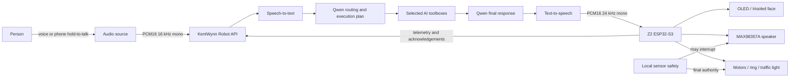
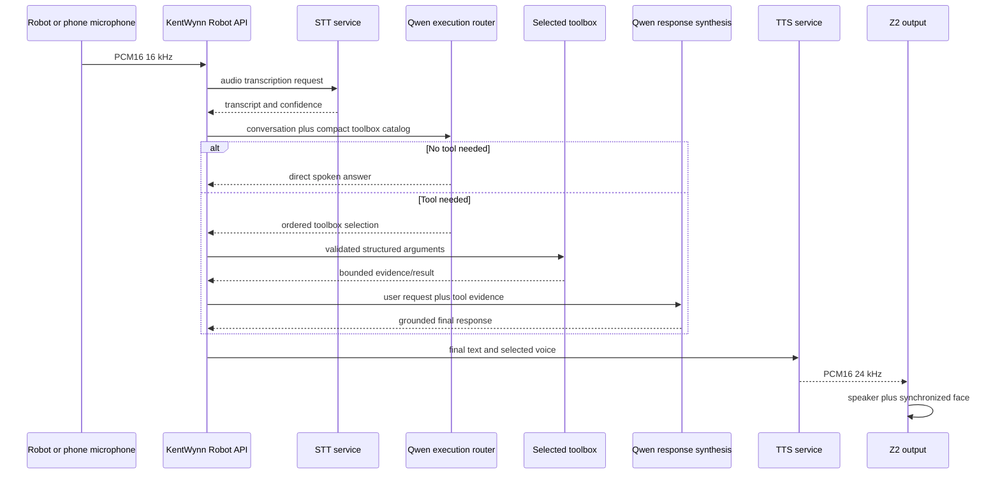
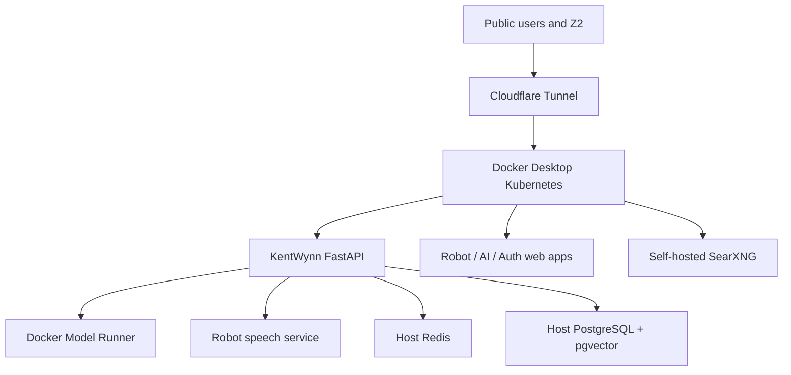

# Z2 End-to-End Architecture

> Current implementation reference for the Z2 robot, its firmware, hardware,
> KentWynn services, AI pipeline, security, and operations.
>
> Last verified against source: 2026-08-10  
> Firmware: `0.2.0`  
> Device identity used by the test robot: `z2-001`

This document is intentionally self-contained. It is written so another human
or AI can understand how Z2 works without needing the development conversation
that produced it. It describes the current implementation, not an idealized
future design. Planned features are explicitly marked.

### Scope

This is a **robot architecture document**, not a complete KentWynn platform
document. It includes only KentWynn components that directly serve Z2:
ownership, robot credentials, configuration, quota attribution, realtime voice,
speech/model services, toolboxes, phone sessions, memory, telemetry, commands,
robot UI, and robot deployment. General KentWynn AI APIs, OpenQuery, blog,
payments, and unrelated product infrastructure are out of scope.

Do not place real credentials, Wi-Fi passwords, OTA passwords, cookies, private
keys, or Kubernetes secret values in this file.

## 1. System at a glance

Z2 is a two-wheel ESP32-S3 desktop robot. The device owns real-time hardware,
local safety, sensing, microphone capture, speaker playback, OLED/face output,
and the local maintenance UI. KentWynn owns accounts, robot configuration,
authentication, AI inference orchestration, speech services, tools, memory,
phone sessions, telemetry state, and usage accounting.



The central ownership rule is:

- The AI may propose actions.
- The API validates, queues, and tracks actions.
- Firmware decides whether an action is locally safe.
- Local safety always has final authority, even when the API is offline.

## 2. Repository boundaries

### Z2 firmware repository

This repository contains only Z2 firmware and device-side assets:

- `src/main.cpp` — composition root.
- `src/app/` — global application state and Arduino lifecycle.
- `src/devices/` — motors, audio, OLED, ambient ring, and traffic light.
- `src/sensors/` — ultrasonic and time-of-flight sensors.
- `src/safety/` — directional limits, cliff handling, and local recovery.
- `src/domain/` — manual drive, auto drive, and presentation arbitration.
- `src/network/` — Wi-Fi, onboarding, OTA, realtime chat, and control channel.
- `src/ui/` — the local `z2-001.local` maintenance/control page.
- `config/hardware_pin_map.json` — authoritative machine-readable hardware and
  drivetrain profile.
- `include/generated_hardware_profile.h` — generated drivetrain constants; do
  not edit it manually.
- `include/robot_config.h` — non-secret device and transport constants.
- `platformio.ini` and `boards/z2_n16r8.json` — ESP32-S3 build definition.
- `z2.sh` — supported build, USB flash, monitor, and OTA workflow.

The firmware is divided into `.inc` fragments but compiles as one Arduino
translation unit. This keeps shared real-time state deterministic on the
microcontroller.

### KentWynn repository

The companion service repository is named `kentwynn`. Its robot-relevant
components are:

- `api/` — FastAPI robot, account, model, quota, phone, and toolbox services.
- `ai/` — KentWynn AI/account-facing web interface.
- `auth/` — authentication and account UI.
- `helm/kentwynn/` — Kubernetes deployment configuration.
- `configs/model_aliases.json` — public model aliases to internal models.
- `docker/` and `docker-compose.yml` — local supporting services and images.
- `Makefile` — build, deployment, model, Redis, PostgreSQL, and tunnel commands.

Z1 is a separate project. Never apply Z1 pin mappings or firmware edits to Z2
without an explicit migration decision.

## 3. Compute platform

| Item | Current value |
|---|---|
| MCU module | ESP32-S3-WROOM-1-N16R8 |
| CPU | ESP32-S3, configured at 240 MHz |
| Flash | 16 MB |
| PSRAM | 8 MB octal PSRAM |
| Framework | Arduino on Espressif32 |
| Firmware environment | PlatformIO `z2` |
| Flash mode | QIO, 80 MHz |
| USB | Native ESP32-S3 USB CDC enabled |
| Network | 2.4 GHz Wi-Fi; Bluetooth capability exists in board metadata but is not part of the current Z2 application |
| Local hostname | `z2-001.local` through mDNS |

GPIO35–GPIO37 are reserved by octal PSRAM and must not be assigned to external
hardware.

## 4. Electrical and power architecture

### Voltage domains

| Domain | Used by | Important rule |
|---|---|---|
| ESP32 3.3 V | TB6612 logic VCC, INMP441, OLED, VEML7700, all VL53 sensors, TCRT-5000 modules, GPIO logic | Never apply a 5 V signal directly to an ESP32 GPIO. |
| Regulated 5 V | NeoPixel ring, HY-SRF05, MAX98357A supply in the current wiring description | Keep this rail regulated at 5 V. Do not connect the ring to a 6 V or 6.6 V motor rail. |
| Motor rail / TB6612 VM | Two N20 gear motors | Supplied from the LM2596 output used for the drivetrain. Confirm the physical voltage before changing it. |
| Common ground | ESP32, LM2596, motor driver, sensors, speaker amplifier, lights | Every module must share the same electrical ground. |

The source does **not** define the battery chemistry, cell count, charger,
protection board, main battery voltage, or an authoritative final LM2596 motor
voltage. A previously observed display value such as 6.9 V is not sufficient to
define the electrical design. Measure the physical rails before wiring or
changing power components.

### HY-SRF05 echo protection

The HY-SRF05 ECHO signal is 5 V while ESP32 GPIO40 is 3.3 V-only. Use the
documented divider topology:

```text
HY-SRF05 ECHO ---- 10 kOhm ----+---- GPIO40
                               |
                             20 kOhm
                               |
                              GND
```

This is two resistors, not one series resistor. The divider reduces a 5 V echo
to approximately 3.3 V.

## 5. Hardware map

The JSON file is the source of truth. The table below is a readable copy.

### Motor driver and drivetrain

| Function | Pin / value |
|---|---|
| Driver | TB6612FNG |
| PWMA / right motor PWM | GPIO10 |
| AIN1 / AIN2 | GPIO8 / GPIO7 |
| PWMB / left motor PWM | GPIO11 |
| BIN1 / BIN2 | GPIO13 / GPIO41 |
| STBY | GPIO12 |
| Right motor outputs | AO1 / AO2 |
| Left motor outputs | BO1 / BO2 |
| PWM | 20 kHz, 8-bit, maximum 255 |
| Wheel diameter | 40 mm |
| Wheel-center spacing | 100 mm |
| Rated gear motor speed | 30 RPM |
| Measured linear calibration | 1.46597 cm/s at the calibrated reference |
| Measured angular calibration | 12.64198 degrees/s at the calibrated reference |
| Feedback | Open-loop timed; no wheel encoders or odometry |

Distance and rotation are calibrated estimates. Completion means the requested
motor duration completed without local safety interrupting it; it does not mean
the physical distance is encoder-verified.

### Audio

| Device | Wiring |
|---|---|
| MAX98357A speaker amplifier | WS/LRC GPIO4, BCLK GPIO5, DIN GPIO6, SD GPIO3, common ground |
| Speaker | 3 W, 8 ohm, connected to amplifier `+` and `-` outputs |
| INMP441 microphone | SD GPIO9, WS GPIO4, SCK GPIO5, L/R to GND, 3.3 V, common ground |

The microphone and speaker share I2S clock pins. Firmware coordinates capture
and playback and guards the microphone after local sounds to reduce self-
triggering.

### I2C bus

| Signal | Pin |
|---|---|
| SDA | GPIO47 |
| SCL | GPIO42 |

Devices on the bus:

| Device | Address / control |
|---|---|
| SSD1306 128x64 OLED | `0x3C` |
| VEML7700 ambient light | `0x10` |
| Front-left VL53L1X | XSHUT GPIO2, runtime `0x30` |
| Front-right VL53L0X | XSHUT GPIO39, runtime `0x31` |
| Rear VL53L1X | XSHUT GPIO1, runtime `0x32` |

The firmware holds all ToF sensors in shutdown, then initializes them one at a
time and assigns unique runtime addresses.

### Remaining I/O

| Device | Wiring |
|---|---|
| HY-SRF05 | Trigger GPIO18; protected Echo GPIO40; regulated 5 V |
| Cliff left TCRT-5000 | D0 GPIO45; 3.3 V |
| Cliff right TCRT-5000 | D0 GPIO48; 3.3 V |
| NeoPixel ring | data GPIO14; 12 GRB pixels; 800 kHz; regulated 5 V; firmware brightness limit 180 |
| Traffic green | GPIO15, active HIGH |
| Traffic yellow | GPIO16, active HIGH |
| Traffic red | GPIO17, active HIGH |

The cliff modules report HIGH when floor reflection is missing and LOW when
supported floor is detected.

## 6. Device boot and local operation

Boot order is approximately:

1. Load onboarding and NVS state.
2. Initialize motor pins and stop both motors.
3. Initialize traffic lights and run startup indication.
4. Initialize cliff, ultrasonic, ring, I2S audio, OLED, and I2C.
5. Start Wi-Fi or captive setup mode.
6. Start OTA.
7. Synchronize managed robot configuration and report status.
8. Start realtime voice and control WebSockets.
9. Initialize ambient light and ToF sensors.
10. Enter the cooperative Arduino loop for sensing, safety, networking, UI,
    audio, control, and presentation updates.

`All Off` is virtual power, not a full electrical shutdown. It stops motors,
turns off display/ring/traffic output, disables amplifier output, and leaves
network management available.

## 7. Local safety architecture

Safety is firmware-owned and independent of the cloud.

### Thresholds

| Purpose | Stop / trigger | Reset / clear |
|---|---:|---:|
| Ultrasonic emergency boundary | 20 cm | 25 cm |
| ToF emergency boundary | 200 mm | 250 mm |
| General warning | 25 cm / 250 mm | Configuration dependent |
| Stationary near-contact reaction | 6 cm / 60 mm | Short hold and clear logic |
| Cliff sampling | every 10 ms | 3-sample debounce, 300 ms supported-floor re-arm |

Unavailable or out-of-range distance readings contribute no restriction. Any
valid close reading remains authoritative. A failed sensor therefore cannot
invent an obstacle, but it also cannot protect an unseen direction.

### Priority and behavior

1. Cliff danger has highest presentation and movement priority.
2. Active local cliff or proximity recovery rejects external drive commands.
3. Directional obstacle checks reject movement into a valid close boundary.
4. Safety can interrupt AI speech playback and AI motor plans.
5. Manual, auto-drive, and AI commands all pass through the same local checks.

Cliff recovery is feedback-controlled: when enabled, the robot reverses until
both cliff sensors report supported floor. A valid rear hard boundary stops
recovery and produces a blocked notification.

General proximity recovery chooses a kinematically eligible direction, scores
eligible directions using available clearance, continuously rechecks sensors,
and stops when the triggering boundary clears or when a bounded 900 ms escape
attempt cannot clear it. The bounded limit prevents a moving obstacle from
causing indefinite blind motion. This bound is for autonomous safety recovery,
not for user-requested calibrated movement.

Automatic safety recovery is user-configurable. Collision and cliff stopping
remain local even if automatic escape is disabled.

### Presentation arbitration

Presentation owners are prioritized logical slots:

- Idle
- Identity
- Voice
- Control
- Interaction
- System
- Safety

Higher-priority active states override lower-priority states. Clearing a safety
state reveals the next valid presentation rather than leaving the warning face
latched. Safety presets may control face, animation, and sound. Auto-drive
silent mode suppresses its repeated sound cues, not safety decisions.

## 8. Manual drive and auto drive

Manual command primitives are:

| Code | Meaning |
|---|---|
| `F` | Forward |
| `B` | Backward |
| `L` / `X` | Pivot left |
| `R` / `Y` | Pivot right |
| `S` or other | Stop |

The browser control endpoint is local. Releasing a control causes Stop. The
firmware also has a command watchdog, but timed AI movements refresh their
lease until their calibrated duration completes or safety interrupts them.

Auto drive is opt-in and starts disabled after reboot. It requires the two
front ToF sensors to initialize. It uses valid front ToF and sonar readings,
chooses the clearer side, reverses only when the rear path allows it, and is
always subordinate to cliff and obstacle safety. User-configurable cruise PWM
can reach 255.

## 9. OLED, face, lights, and sound

The OLED normally shows an Irisoled-style animated robot face. Supported face
states include neutral, happy, curious, sleepy, thinking, surprised, excited,
sad, love, confused, angry, alert, focused, furious, scared, worried, bored,
and despair.

The API can temporarily replace the face with toolbox-specific information.
Robot Control can also draw bounded OLED primitives:

- text
- line
- rectangle
- circle

The canvas is 128x64 and accepts at most 12 primitives in one action. After a
temporary display expires, normal face/presentation ownership resumes.

The NeoPixel ring supports Auto, Off, White, Red, Green, Blue, and Rainbow.
Auto mode uses ambient light to adjust presentation. The traffic light provides
clear movement/safety state. Sounds are bounded named local cues such as beep,
double, chirp, help, and alarm; normal AI speech arrives as streamed PCM.

## 10. Wi-Fi onboarding, claiming, and OTA

### Blank-device Wi-Fi setup

Wi-Fi credentials are not compiled into firmware and are not stored in the
KentWynn API. A device without working Wi-Fi enters captive setup mode:

1. Z2 creates a protected local setup network.
2. OLED shows a large setup QR while the RGB ring remains off.
3. The setup page scans nearby networks or permits manual SSID entry.
4. The candidate network is stored in device-local NVS.
5. Z2 restarts and tests the network.
6. If it fails, Z2 can return to previous credentials or setup mode.

### Robot claim

The server stores a short-lived hashed claim code. An authenticated KentWynn
account claims the robot using the public robot ID plus claim code. Claiming
binds the robot record to an account; it does not expose the device credential.

### Device credential

The robot uses a scoped `rk_` credential in the `X-AI-Token` header. The device
stores its credential in NVS. The server stores a hash and prefix, not the
plaintext credential. Robot credentials can be disabled or revoked. Never put
the credential in a URL or QR code.

### OTA

The first OTA-capable installation requires USB:

```bash
./z2.sh flash
```

This installs/provisions a random device-scoped OTA password over the physical
serial connection. On macOS, the development copy is stored in Keychain under
the Z2 service/account entry. The robot stores its copy in NVS. KentWynn can
hold an encrypted managed copy and synchronize it to the device; plaintext must
never appear in source control or logs.

Later updates use:

```bash
./z2.sh ota
```

OTA resolves `z2-001.local`, authenticates on port 3232, builds the firmware,
stops motors before update, writes the image, and restarts the device. Windows,
Linux, or production tooling should use the same device-scoped credential
concept with an OS-appropriate secret store rather than depending on macOS
Keychain.

## 11. Robot-facing authentication and token management

KentWynn accepts three authentication classes:

| Credential | Purpose | Server handling |
|---|---|---|
| Console JWT | Signed-in account and administrative UI | JWT subject resolves to an active user |
| `sk_...secret` API key | Account/API access that may share the owner's quota system | Prefix locates the key; full value is password-hash verified |
| `rk_...` robot credential | One claimed robot device | Resolves robot, owner, permissions, and robot usage context |

Credentials are sent in `X-AI-Token` or an Authorization header. WebSockets use
the same resolver as HTTP. Tokens must not be sent in query strings.

The shared account layer supports the following controls where they affect
robot-owner quota and account reporting:

- enabled/disabled state
- optional expiry
- per-key operation permissions
- per-minute rate limits
- per-key daily quota
- cumulative and daily token usage
- last-used timestamp

Robot owners have a quota record. Robot model use records append-only usage
events containing user, optional API key, product, source, operation, model
alias, request ID, input tokens, output tokens, and total tokens. Robot usage is
attributed as product `robot`, source `robot_device`, operation `chat`.

Redis provides fast rate-limit and concurrency state. PostgreSQL remains the
durable source for users, keys, quotas, usage events, robots, memories, and
relationships. Usage accounting accepts both common naming conventions:
`prompt_tokens`/`completion_tokens` and `input_tokens`/`output_tokens`.

## 12. Realtime voice protocol

### Realtime channels

Z2 uses two authenticated TLS WebSockets:

| Path | Responsibility |
|---|---|
| `/v1/robot/chat` | Session configuration, wake/speech audio, transcripts, model/tool events, reply text, TTS audio |
| `/v1/robot/control` | Device commands, config notifications, phone events, telemetry, diagnostics, acknowledgements |

The control channel is long-lived and reconnects as needed. The chat channel is
session-oriented: firmware opens it for an active onboard or phone voice
session, keeps it alive while that session is active, and closes it normally
when the session ends.

Firmware trusts the configured root CA for `api.kentwynn.com`. Application
writes are serialized server-side so concurrent heartbeat, phone, command, and
audio producers cannot corrupt one WebSocket.

### Audio contract

| Direction | Format |
|---|---|
| Robot or phone to API | PCM16, mono, 16 kHz |
| API to robot speaker | PCM16, mono, 24 kHz |

The firmware uses WebRTC VAD plus an adaptive energy floor. It retains 500 ms
of pre-roll, records at least 1.5 seconds for wake detection, permits up to 4
seconds for a wake utterance and 15 seconds for a request, and waits 1.2 seconds
of trailing silence before ending speech. The configured INMP441 PCM gain is
2x.

The firmware slices outgoing binary audio into small safe WebSocket frames.
The API aggregates audio until `audio.end`, converts it for the STT provider,
and rejects uncertain/no-speech results using returned confidence metadata.

### Important event sequence

```text
robot -> session.start
api   -> session.started
robot -> audio.start
robot -> binary PCM frames
robot -> audio.end
api   -> transcript.processing
api   -> transcript.final or wake.rejected / speech.rejected
api   -> reply.started
api   -> execution.plan / toolbox.used / toolbox.display (when needed)
api   -> reply.presentation and reply.emotion
api   -> reply.audio.start
api   -> binary PCM frames
api   -> reply.audio.end
api   -> reply.complete
api   -> wake.ready, session.timeout, or session.end
```

The device prebuffers approximately 250 ms of output audio and uses a PSRAM
ring buffer sized for concise replies. Playback is asynchronous so WebSocket
polling continues during speech.

Wake phrase, robot name, language, voice, personality, thinking mode, and
follow-up duration are server-managed. Firmware contains no conversational
fallback personality and does not hardcode the active wake word.

## 13. AI and speech pipeline

The current logical pipeline is:



Current services and aliases:

- Reasoning alias: `kentwynn/reasoning`.
- Current internal reasoning model: `ai/qwen3` through Docker Model Runner.
- STT interface: OpenAI-compatible `/v1/audio/transcriptions`; configured
  default model name `whisper-1`.
- TTS interface: OpenAI-compatible `/v1/audio/speech`; configured default model
  `kokoro` and default voice `af_heart`.
- English uses installed Kokoro voices.
- Thai requires the installed `th_espeak` voice.
- Vietnamese requires the installed `vi_espeak` voice.
- Supported language configuration is `auto`, English (`en`), Thai (`th`), or
  Vietnamese (`vi`), with validation preventing unsupported language/voice
  combinations.

The model is kept warm during active robot use to reduce cold-start latency.
Timing events expose STT, routing/model, first TTS audio, speaker completion,
and total-turn latency for diagnosis.

## 14. Execution Plan and AI toolboxes

Execution Plan is a system-owned internal router. It is visible in UI but is
not directly callable as a normal model tool and cannot be disabled. It selects
the smallest sufficient ordered toolbox set. Ordinary conversation should use
no toolbox.

| Toolbox | Responsibility |
|---|---|
| Execution Plan | Internal routing, ordered multi-tool progress, and selection validation |
| Local Context | Read configured time, timezone, and location through API/UI; temporal facts already injected into chat are answered directly |
| Weather | Current conditions and forecast from Open-Meteo at configured coordinates |
| Internet | Current public web search and selected public-page reading through self-hosted SearXNG |
| Conversation | Inspect or explicitly end the voice session |
| Phone Connect | Pair/disconnect phone microphone and request temporary phone location |
| People & Memory | Verified-person facts, corrections, forgetting, and attributed relationship claims |
| Robot Hardware | Read-only live telemetry and installed capabilities |
| Robot Control | Validated timed physical plan for motors, ring, sound, OLED/face, and traffic lights |

Routing and execution are model-driven, not phrase-list driven. Deterministic
code is used for schema validation, credentials, permissions, transport,
physical bounds, evidence, acknowledgement, and safety.

For Robot Control:

1. Router selects `robot_control` only for an intentional physical request.
2. A separate model pass classifies authorized physical modalities.
3. Qwen produces structured motions and presentation actions.
4. API removes any modality not authorized by the physical contract.
5. API converts calibrated movement units to queued device commands.
6. Firmware validates local capability and safety.
7. Firmware acknowledges executed or rejected state.
8. API speaks a final result grounded in acknowledgement evidence.

Physical success must be supported by the audit trail:

```text
AI toolbox: robot_control
Control queued
Control executed
```

A spoken promise alone is not execution evidence.

## 15. Command and telemetry plane

API commands are stored briefly in Redis and streamed to the authenticated
control channel. Each command has an ID, creation time, optional scheduled
start, expiry, source, and bounded arguments. Firmware sends a terminal
`device.command.ack` with `executed` or `rejected` and a detail string.

The API waits for acknowledgement and removes completed queue entries. HTTP
polling remains a recovery path, not the primary concurrent transport.

Telemetry includes:

- Wi-Fi and device presence
- motor readiness, direction, PWM, and auto-drive state
- ultrasonic validity and distance
- three ToF readiness, validity, model, and distance values
- two cliff states
- ambient lux
- microphone and speaker readiness
- OLED, ring, and traffic capabilities
- safety stop and local recovery state
- drivetrain dimensions and calibration
- firmware version and last-seen time

Redis holds short-lived telemetry, activity, command queue/status, config event,
phone session, conversation continuity, weather cache, rate-limit, and model-
warm state. PostgreSQL holds durable robot/account data.

## 16. Phone Connect

Phone Connect is optional. Z2 remains the AI, face, speaker, and physical robot;
the phone becomes a higher-quality hold-to-talk microphone and can provide
temporary location.

Flow:

1. Voice or robot UI requests pairing.
2. API creates a random one-use reference valid for 60 seconds.
3. Z2 shows a full-screen QR and keeps the RGB ring off.
4. First phone to redeem the reference receives an opaque Secure, HttpOnly
   temporary session cookie.
5. Phone opens `/v1/robot/phone/chat`, requests microphone permission, and uses
   hold-to-talk.
6. Onboard microphone is suspended while the phone session is active.
7. Phone sends PCM16 16 kHz; TTS still plays only on Z2.
8. Explicit disconnect or approximately five minutes of inactivity cleans up
   the session and restores onboard wake listening.

The QR contains only the short-lived pairing reference. It never contains
robot credentials, account credentials, API keys, Wi-Fi passwords, or OTA
passwords.

Phone location is requested only when a tool needs it. It remains session-
scoped, carries coordinates, accuracy, capture time, and source, and never
silently overwrites the robot's configured home location.

## 17. People, voice identity, memory, and relationships

Current person identity is phone-audio based. The onboard microphone does not
perform owner voice verification. Phone enrollment stores multiple 512-
dimension speaker embeddings and calibration metadata. Current schema names
the embedding model `speechbrain/spkrec-ecapa-voxceleb`.

After successful phone verification:

- the session may load only that speaker's personal memories;
- low-confidence audio remains Unknown;
- private memories are not exposed to an unknown speaker;
- identity is acknowledged once per phone session, not on every turn.

Memory is selective. Store durable facts, names, stable preferences,
corrections, and meaningful relationships. Do not persist full transcripts,
small talk, temporary moods, ordinary questions, weather results, or unsupported
inferences. Pending memory writes are committed during clean phone-session
cleanup so they do not interrupt live conversation.

Relationship claims are attributed to the claimant and can be confirmed,
disputed, edited, or removed. A claim such as “Eliyah is my daughter” does not
grant account or robot permissions.

Durable PostgreSQL records include robot profiles, speaker profiles, individual
speaker samples, memories, and relationship data. Redis contains only active
phone/session state and pending writes.

## 18. Web and account surfaces

| Surface | Purpose |
|---|---|
| `http://z2-001.local/` | Local maintenance, Wi-Fi recovery, hardware control, diagnostics, OTA readiness |
| `https://robot.kentwynn.com/robots` | Account robot inventory and online state |
| `https://robot.kentwynn.com/robots/<id>` | Robot configuration and status |
| `.../ai-chat` | Voice personality, wake, language, voice, and chat settings |
| `.../ai-tools` | Toolbox registry, live values, and OLED previews |
| `.../people-memory` | Person profiles, memories, and relationships |
| `.../safety` | Safety presentation, automatic recovery, speed, and silent auto-drive settings |
| `.../robot-log` or diagnostics surface | Timestamped device/API activity separate from toolbox cards |
| `/phone/<reference>` | Temporary login-free phone companion after one-use redemption |

Robot online state comes from authenticated device presence and `last_seen_at`,
not merely from a saved robot record or browser page being open.

## 19. Deployment topology

Current development/alpha topology:



The robot API and robot-facing web services deploy through Helm. Redis and PostgreSQL currently
run as supporting Docker services outside Kubernetes and are exposed to the
cluster through configured service endpoints. Cloudflare Tunnel provides the
public ingress without embedding public credentials in firmware.

Common commands from the KentWynn repository:

```bash
kubectl config current-context
make api-deploy
make models-up
make redis-up
make postgres-up
```

Always verify the Kubernetes context before deploying. Successful deployment
or API tests do not prove physical robot execution; check command
acknowledgements and the real robot.

## 20. Build and verification

From the Z2 repository:

```bash
./z2.sh build
./z2.sh flash
./z2.sh monitor
./z2.sh flash-monitor
./z2.sh ota
```

Verification levels must be reported separately:

1. **Configured** — source/settings contain the intended value.
2. **Compiled** — firmware or service builds successfully.
3. **Deployed/flashed** — the built artifact reached Kubernetes or ESP32.
4. **Connected** — WebSocket, Wi-Fi, and service health are live.
5. **Acknowledged** — device confirms a command terminal state.
6. **Physically user-tested** — the real actuator/output behaved correctly.

Do not call a hardware feature complete at level 2 or 3.

## 21. Known limitations and truthful boundaries

- Drivetrain motion is calibrated open-loop. Exact position needs encoders or
  another odometry source.
- The current onboard INMP441 path is less accurate than modern phone
  microphones in real rooms.
- WebRTC VAD separates likely speech from quiet/noise but is not full ESP-SR
  acoustic echo cancellation or beamforming.
- STT, model routing, toolbox argument generation, tool execution, final
  synthesis, TTS, and playback add cumulative latency.
- The HY-SRF05 requires correct 5 V power and echo level shifting; a missing
  echo is treated as unavailable, not automatically blocked.
- Bluetooth, camera, face recognition, GPS hardware, and vision reasoning are
  not currently implemented on Z2.
- Phone GPS is temporary context, not robot home-location replacement.
- Voice identity is phone-only; onboard owner enrollment is intentionally not
  active.
- Creative physical performances currently require careful alignment between
  the spoken progress message, physical modality contract, generated plan, and
  executed acknowledgements.
- Full conversations are not durable memories.

## 22. Persistent Tasks

The one-time Tasks MVP is implemented in the robot-facing KentWynn API and
Robot UI. Tasks are durable objectives that may be created through the Tasks
page or the Tasks AI toolbox and may continue independently of voice chat.

The intended separation is:

- Conversation session — temporary dialogue and follow-up context.
- Task — durable objective that survives session end, reconnect, or restart.
- Task plan — versioned AI-generated steps using existing toolboxes.
- Task runner — leases one step, validates it, executes it, records evidence,
  and advances or pauses.
- Safety — may interrupt or block a physical step but cannot be overridden by
  the task.
- Task UI — progress, current step, evidence, pause, resume, cancel, and retry.
- Scheduling — one-time future execution and simple daily repetition are active in the normal UI.

Current task states are `ready`, `running`, `waiting`, `paused`, `completed`,
`failed`, and `cancelled`. The runner reuses Execution Plan and existing bounded
toolboxes, persists execution evidence in PostgreSQL, uses Redis for live state
and runner ownership, and recovers incomplete executions after an API restart.
It must never equate a model's spoken promise with completed physical work.

The complete implementation and staged extension contract is documented in
`TASKS_IMPLEMENTATION.md`. Camera observations and vision-triggered execution
remain prepared architectural extensions, not currently active features.

## 23. Design principles for future changes

1. Keep Z1 and Z2 isolated.
2. Treat `config/hardware_pin_map.json` as the hardware source of truth.
3. Keep semantic intent, personality, language understanding, tool selection,
   and creative plans model-driven.
4. Use deterministic code for safety, electrical limits, schemas, permissions,
   credentials, queuing, acknowledgement, and evidence.
5. Never expose secrets in URLs, QR codes, logs, source, or documentation.
6. Keep local safety operational without API connectivity.
7. Do not let cloud commands override an active local recovery.
8. Keep phone capabilities temporary and session-scoped.
9. Store only useful person-scoped memories, not complete conversations.
10. Prefer specialized tools over Internet when both can answer the request.
11. Do not call tools for ordinary conversation or temporal facts already
    supplied in authoritative context.
12. Never claim an actuator ran without a device acknowledgement.

## 24. Authoritative source index

When this document conflicts with running code, verify these files in order:

1. Hardware: `config/hardware_pin_map.json`
2. Generated drivetrain constants: `include/generated_hardware_profile.h`
3. Device constants and shared state: `src/app/context.inc`
4. Safety: `src/safety/cliff_safety.inc`,
   `src/safety/local_recovery.inc`, and `src/safety/safety_zones.inc`
5. Drive behavior: `src/domain/drive_and_autonomy.inc`
6. Voice transport: `src/network/realtime_chat.inc`
7. Command transport/onboarding: `src/network/control_channel.inc` and
   `src/network/robot_onboarding.inc`
8. Device network/OTA: `src/network/network_and_ota.inc` and `z2.sh`
9. API session contract:
   `kentwynn/api/models/robot/session.py`
10. API orchestration and tool execution:
    `kentwynn/api/services/robot/voice_service.py` and
    `kentwynn/api/services/robot/tool_service.py`
11. Realtime routes: `kentwynn/api/routes/robot/chat.py` and
    `kentwynn/api/routes/robot/phone.py`
12. Authentication and quota:
    `kentwynn/api/deps.py`, `kentwynn/api/services/api_key_service.py`, and
    `kentwynn/api/services/quota_service.py`
13. Durable schema: `kentwynn/api/db/models.py`
14. Deployment: `kentwynn/helm/kentwynn/`, `kentwynn/Makefile`, and
    `kentwynn/docker-compose.yml`
