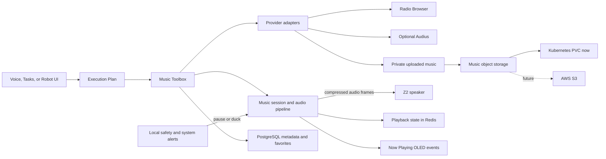

# Z2 Music Toolbox Implementation Plan

> Design contract for a future Z2 Music Toolbox.
>
> Status: **planned, not implemented**  
> Scope: Z2 and robot-facing KentWynn services only  
> Decision date: 2026-08-11

## 1. Product goal

Music lets a person ask A to play online music, listen to internet radio, upload
personally controlled audio, and maintain favorites without exposing provider,
codec, storage, or transport complexity.

Examples:

- “Play some Vietnamese jazz radio.”
- “Play this song.”
- “Save this station as a favorite.”
- “Play my uploaded bedtime song.”
- “Pause the music.”

The AI decides when Music is the relevant toolbox. Deterministic code validates
authorization, provider availability, file safety, playback state, and device
acknowledgements. Intent is not implemented as a hard-coded phrase list.

## 2. Product decisions

The first implementation will follow these decisions:

- Z2 does not scrape YouTube, Spotify, Apple Music, NetEase, or another
  protected catalog.
- Online sources are replaceable providers behind one Music Toolbox contract.
- Radio Browser is the default provider for free live radio.
- Audius may be added as an optional provider for on-demand independent music;
  the Music Toolbox must still function when Audius is disabled.
- Users may upload audio they are authorized to use.
- Uploaded bytes are stored in a private Kubernetes PersistentVolumeClaim
  during the local alpha.
- No host-path or macOS project-folder mount is used for music.
- The alpha accepts that Docker Desktop storage reset or removal may erase
  uploaded songs. The UI must state this limitation clearly.
- PostgreSQL stores metadata and favorites, not audio bytes.
- Audio files are never committed to Git or built into a Docker image.
- The storage interface must be replaceable with AWS S3 later.

## 3. What Xiaozhi demonstrates

The open Xiaozhi server's `play_music` plugin scans a local directory and sends
selected files through its normal audio queue. It does not provide a universal
online music catalog. The useful architectural reference is its transport:
server-provided audio is converted into Opus frames and sent to the ESP32 over
the existing realtime connection.

Z2 should copy that separation:

```text
catalog or upload -> server-side playback pipeline -> compressed frames -> Z2
```

Z2 should not copy Xiaozhi's requirement to pre-populate a local music folder.

References:

- [Xiaozhi music plugin](https://github.com/xinnan-tech/xiaozhi-esp32-server/blob/main/main/xiaozhi-server/plugins_func/functions/play_music.py)
- [Xiaozhi WebSocket audio protocol](https://github.com/78/xiaozhi-esp32/blob/main/docs/websocket.md)
- [Radio Browser wrapper](https://github.com/ivandotv/radio-browser-api)
- [Radio Browser API](https://docs.radio-browser.info/)
- [Audius API](https://docs.audius.co/sdk/)

## 4. Architecture



### Component responsibilities

| Component | Responsibility |
|---|---|
| Music Toolbox | AI-facing search, playback, favorites, and status operations |
| Music provider adapters | Normalize catalogs and resolve playable sources |
| Music storage adapter | Store, retrieve, and delete private uploaded objects |
| Music player | Own the active queue, decoding/transcoding, buffering, and playback lifecycle |
| PostgreSQL | Track metadata, ownership, favorites, and durable playlists later |
| Redis | Active playback session, queue cursor, progress, leases, and live UI events |
| Z2 firmware | Buffer, decode, play, stop, and acknowledge music frames |
| OLED renderer | Show bounded Now Playing presentation and restore the normal face |
| Local safety | Remain authoritative and interrupt or lower music when necessary |

## 5. Music Toolbox contract

Initial operations:

| Operation | Purpose |
|---|---|
| `search` | Search enabled providers by title, artist, genre, station, or mood |
| `play` | Resolve and start a track, uploaded item, station, or queue |
| `pause` | Pause the active music session |
| `resume` | Resume a paused session |
| `stop` | End playback and release the speaker |
| `next` | Move to the next queued item when available |
| `previous` | Return to the previous queued item when available |
| `status` | Return the authoritative player and current-item state |
| `favorite_add` | Save a provider reference or uploaded item reference |
| `favorite_remove` | Remove a favorite reference |
| `favorite_list` | List available favorites without exposing private storage paths |

The toolbox returns structured provider and playback evidence. Spoken success
must not be emitted merely because a provider returned search metadata.
Playback begins only after the player and device acknowledge the stream.

Example normalized source:

```json
{
  "provider": "radio_browser",
  "media_type": "station",
  "provider_id": "station-uuid",
  "title": "Example Radio",
  "artist": null,
  "artwork_url": "https://example.invalid/icon.png",
  "duration_ms": null,
  "stream_resolved": true
}
```

## 6. Provider model

Every provider implements the same bounded interface:

```text
search(query, filters)
resolve(provider_id)
get_metadata(provider_id)
health()
```

Providers never write directly to favorites or device state.

### Radio Browser

- Enabled by default.
- Requires no account key.
- Supports station, country, language, codec, and tag discovery.
- Uses `url_resolved` for playback.
- Filters failed stations and rechecks reachability before playback.
- A favorite stores the station UUID, not the raw stream as the primary key.
- Current-song metadata may be unavailable or inconsistent because stations
  control their own ICY metadata.

### Audius

- Optional and disabled when credentials are absent.
- Used for on-demand tracks, artists, and playlists available in its catalog.
- Provider limits and failures must not make uploaded music or radio unusable.
- Search and metadata results may be cached in Redis.
- Credentials remain server-side.

### Uploaded music

- Available only to the authenticated account that uploaded it, unless a future
  sharing feature is explicitly designed.
- Uploading is optional; it is not required to use radio.
- The user is responsible for having the right to upload and play the content.
- Original filenames are metadata only and are never used as storage paths.

## 7. Private alpha storage

### Kubernetes storage

Use a dedicated PVC, for example:

```text
kentwynn-music-data
```

Mount it only into the service that needs to receive and stream uploaded music.
Do not use `hostPath`, a bind mount to `/Users/...`, or a mount of the KentWynn
repository. A compromised music container must not receive general access to
the macOS filesystem.

The local Docker Desktop storage class may implement the PVC inside Docker's
managed Linux VM. It normally survives pod replacement, image deployment, and
ordinary Docker restarts. It is not guaranteed to survive Docker Desktop reset,
factory reset, uninstall, or manual volume deletion.

### Storage adapter

Application code uses a provider-neutral interface:

```text
put(object_key, stream)
open(object_key, byte_range)
stat(object_key)
delete(object_key)
```

Local alpha implementation writes to the PVC. A later S3 implementation uses
the same object keys and service contract.

Object keys are generated identifiers:

```text
accounts/<account_uuid>/tracks/<track_uuid>/original
```

Neither API responses nor logs expose the mounted filesystem path.

### Missing objects

If PVC data is lost while PostgreSQL metadata survives:

- The item becomes `unavailable`.
- It cannot be reported as playable.
- The UI offers **Upload again**.
- Favorites may retain the metadata reference for reattachment.
- No task or conversation may claim playback succeeded.

## 8. Upload security

The upload path must enforce:

- Authenticated account and robot authorization.
- Per-file and per-account quotas.
- Streaming upload with bounded memory usage.
- Generated object keys and path traversal prevention.
- MIME sniffing from file contents rather than trusting the extension.
- A small allowlist of supported audio containers and codecs.
- Duration and decode validation before marking an item ready.
- Rejection of executable, archive, malformed, or unsupported content.
- Private-by-default metadata and objects.
- No public static directory for uploaded audio.
- No secrets, signed object links, or local paths in diagnostics.
- Explicit deletion that removes both the object and its playable references.

For the alpha, quotas should be conservative and configurable rather than
embedded in the AI prompt.

## 9. Playback and concurrency

Music is a durable playback session, not a chat response and not TTS.

The player owns the speaker resource while active. Voice chat remains able to
receive commands such as pause, stop, or lower volume. Other speaker operations
must either queue, duck music, or clearly report that the speaker is busy.

Expected priority:

```text
local safety/system alert > active conversation/TTS > music > idle sound
```

Important behavior:

- Safety can interrupt playback without API permission.
- A voice request can temporarily duck or pause music.
- Music may continue after the conversation that started it ends.
- The player maintains a bounded jitter buffer.
- Provider stalls and device disconnects have bounded recovery.
- Ten clients do not share one global queue or decoder state.
- Provider metadata requests are cached and rate-limited independently from
  continuous audio transfer.
- An account or robot receives at most one active music session initially.

The exact codec must be selected after measuring the existing Z2 audio path.
The preferred direction is Xiaozhi-style compressed streaming rather than
full-song PCM storage in API memory.

## 10. OLED and presentation

Music owns a dedicated **Now Playing** OLED presentation while playback is
active, subject to the existing presentation priority system:

```text
safety > system error > conversation/tool result > music now playing > normal face
```

The 128x64 monochrome layout should show:

- Play, pause, buffering, or unavailable state.
- Track or station title.
- Artist or station genre when available.
- Progress bar for finite tracks.
- Live indicator for radio.
- Compact animated equalizer during confirmed playback.
- Favorite state.

Artwork is optional. If implemented, the API produces a bounded monochrome
bitmap; Z2 does not download and decode arbitrary remote images. Long titles
scroll slowly and remain readable. When playback stops, the normal Irisoled
face is restored.

The Robot UI and Phone Connect UI should show richer artwork, queue, provider,
duration, progress, and controls using the same authoritative playback events.

## 11. Favorites

Favorites store references, never duplicated provider audio:

```json
{
  "provider": "audius",
  "media_type": "track",
  "provider_id": "provider-track-id",
  "title": "Song title",
  "artist": "Artist",
  "artwork_url": "https://example.invalid/art.jpg",
  "availability": "available"
}
```

Uploaded favorites reference the internal track UUID. Radio favorites reference
the Radio Browser station UUID. Availability is revalidated at play time.

The first version scopes favorites to the authenticated robot account. A future
person-specific favorite layer may be added only when identity and permissions
are sufficiently reliable.

## 12. User experience

### Music page

The robot site should eventually provide:

- Search across enabled providers.
- Upload area with progress and validation state.
- Now Playing card.
- Queue and playback controls.
- Favorites.
- Storage usage and alpha-loss warning.
- Re-upload flow for unavailable local objects.
- Provider availability without exposing credentials.

The interface must clearly distinguish:

- Found in catalog.
- Resolving stream.
- Buffering.
- Playing and acknowledged by Z2.
- Paused.
- Unavailable.
- Failed.

### AI behavior

AI chooses the relevant Music operation and provider from current capabilities.
It may ask a concise question when several materially different matches exist.
It must not promise a specific commercial song when only a similarly named
radio station or unrelated result is available.

## 13. Observability

Diagnostics record:

- Provider selected and bounded request timing.
- Resolved media identifier, never private object paths or provider secrets.
- Decode/transcode start and first-frame timing.
- Device buffer and playback acknowledgement.
- Pause, resume, stop, interruption, and cleanup reason.
- Provider and storage failures using structured codes.

Do not log raw audio, full signed URLs, access tokens, or uploaded file contents.

## 14. Test plan

### Storage and security

- Upload survives pod replacement and ordinary Docker restart.
- Docker Desktop storage reset produces `unavailable`, not false success.
- Music PVC is mounted only to the intended service.
- No host path or project directory is mounted.
- Path traversal, false MIME, oversized, malformed, and unsupported uploads are rejected.
- Unauthorized accounts cannot enumerate or play another account's uploads.
- Delete removes the playable object and invalidates active references.

### Providers

- Radio Browser search filters unavailable stations and uses `url_resolved`.
- Provider outage does not block uploaded music or other providers.
- Optional Audius absence is represented as disabled, not an application error.
- Search caching reduces repeated provider requests.
- Favorites survive provider downtime and show accurate availability.

### Playback

- Device acknowledgement proves playback started.
- Pause, resume, stop, next, and disconnect clean up correctly.
- Conversation and safety priority interrupt or duck music as designed.
- Ten concurrent robot sessions have isolated state and bounded resources.
- A provider stall cannot hang the robot chat WebSocket.
- Music continues after the originating chat ends when appropriate.
- Reconnection does not duplicate or restart a track without policy.

### Presentation

- OLED shows correct track/station and state.
- Radio shows `LIVE`; finite tracks show progress.
- Safety presentation overrides music and Now Playing returns afterward.
- Stopped music restores the normal face.
- Robot and phone UIs remain synchronized with authoritative playback events.

## 15. Implementation phases

### Phase 1 — foundation

- Music Toolbox contract and provider interface.
- Radio Browser provider.
- Private upload API and Kubernetes PVC.
- PostgreSQL metadata and account-scoped favorites.
- One active music session per robot.
- Basic decode/stream/stop pipeline.
- OLED Now Playing view.

### Phase 2 — playback quality

- Compressed device streaming and measured buffer tuning.
- Pause/resume/seek where the source supports it.
- Queue, next, previous, and reconnect behavior.
- Conversation ducking and priority arbitration.

### Phase 3 — optional catalogs and cloud storage

- Optional Audius provider.
- AWS S3 storage adapter and migration/export flow.
- Signed upload/download operations within the private service boundary.
- Richer phone and robot web playback UI.

### Deferred

- Spotify, Apple Music, or another subscription integration.
- Person-scoped favorites.
- Sharing uploaded music between accounts.
- Public uploads or public object URLs.
- Lyrics licensing and synchronized lyrics.
- Bluetooth A2DP.

## 16. Acceptance criteria

The Music Toolbox foundation is complete only when:

- AI can find and start a playable source through a bounded toolbox call.
- Uploaded audio is private and stored without a host filesystem mount.
- Playback has device acknowledgement rather than spoken success alone.
- Favorites store references rather than duplicate audio.
- OLED and web UIs show the same authoritative playback state.
- Music cannot override local safety or conceal a system alert.
- Provider or storage loss fails clearly and never hangs voice chat.
- The storage adapter can move from PVC to S3 without changing AI tool schemas.

