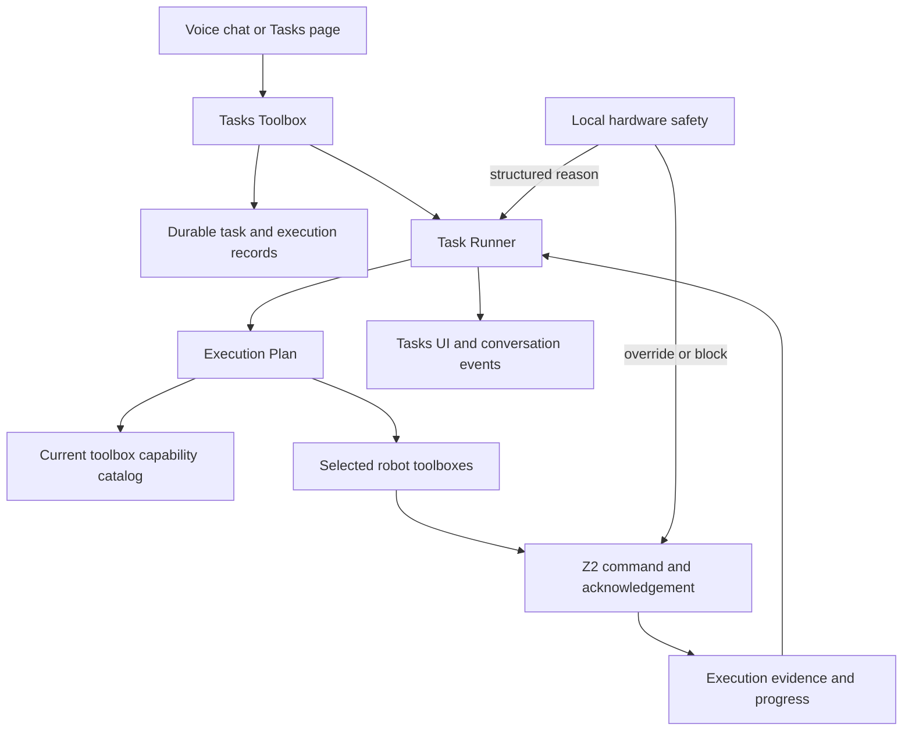

# Z2 Tasks Implementation Plan

> Implementation contract and current MVP reference.
>
> Scope: Z2 and the robot-facing KentWynn services only.
>
> Implemented and deployed: 2026-08-10

## 1. Product goal

Tasks let a person tell A what outcome they want without configuring tools,
workflows, JSON, sensors, or execution details.

The normal experience is one instruction:

> Move forward 20 centimetres, turn around, and return.

AI interprets the goal, selects the available toolboxes, builds an execution
plan, performs the work, and reports truthful progress. A task may continue
after the chat session that created it has ended.

The current release supports manual one-time tasks, future one-time tasks, and
a simple Repeat switch for daily execution. The data model leaves a clean
extension point for event and vision tasks, but those modes are not enabled.

## 2. User experience

### Tasks page

The primary page contains:

- One input labelled **What should A do?**
- **Now** or **Later**
- Date and time when **Later** is selected
- A Repeat switch: off runs once; on repeats every day at that time
- A context-aware **Create and run**, **Schedule task**, or **Save changes** button
- A compact list of task cards

Each card shows only:

- Task title or short AI-generated summary
- Status: `Ready`, `Running`, `Waiting`, `Paused`, `Completed`, or `Failed`
- One short progress sentence
- Relevant actions: `Run`, `Pause`, `Resume`, `Edit`, `Cancel`, or `Delete`

Controls appear only when valid for the current state. Completed and cancelled
tasks do not show irrelevant controls.

Technical steps, tool arguments, leases, locks, command IDs, and raw model
output belong in the existing diagnostics experience, not the normal Tasks UI.

### Create and edit

The user edits the natural-language instruction, not a generated workflow.

For an unambiguous request, AI creates a short title and a ready task without
asking the user to configure anything. If essential information is missing, AI
asks one concise question before creating or starting the task.

Example:

```text
User: Remind me at five.
A: At 5 AM or 5 PM?
```

Future and recurring tasks use the robot's configured timezone. Each task card
shows its next execution and repetition. When several tasks become due, they
run by due time and then creation time; local safety remains authoritative.

### Voice chat

A task can also be created, inspected, changed, started, paused, resumed,
cancelled, or deleted during normal conversation through the Tasks Toolbox.

Intent determines ownership: when the person explicitly frames an objective as
a task, the router selects Tasks alone and the durable runner invokes the
domain toolboxes. An immediate command that is not framed as a task goes
directly to its domain toolbox and is not silently persisted.

After creating a task, A gives a brief acknowledgement. It must not say the
task is complete until execution evidence confirms completion.

The current conversation remains responsive while a task runs. If the task is
using the speaker, motors, or another exclusive robot capability, A clearly
indicates that the capability is busy rather than silently failing.

## 3. What Tasks is—and is not

A **task** is a durable user objective. It is not:

- A voice-chat session
- A single tool call
- A generated plan
- A complete conversation transcript
- A personal memory

A **task execution** is one attempt to perform a task. A task can have multiple
executions when the user retries it. Historical executions remain unchanged
when the task instruction is edited.

An **execution plan** is generated for a specific execution using the robot's
capabilities at that time. The user does not have to maintain this plan.

## 4. System architecture



Responsibilities remain separate:

| Component | Responsibility |
|---|---|
| Tasks Toolbox | User-facing task lifecycle operations |
| Task service | Validation, authorization, persistence, and state transitions |
| Task Runner | Claim work, execute steps, record evidence, recover, and stop |
| Execution Plan | AI-generated selection and ordering of available tools |
| Existing toolboxes | Perform bounded domain operations |
| Z2 firmware | Execute physical commands and return acknowledgements |
| Local safety | Override unsafe motion independently of API availability |

The Tasks Toolbox can use all enabled toolboxes through Execution Plan. It does
not duplicate weather, Internet, memory, hardware, phone, or robot-control
logic.

## 5. Minimal data model

### Task

```json
{
  "id": "task_...",
  "robot_id": "...",
  "instruction": "Move forward 20 centimetres, turn around, and return.",
  "title": "Move, turn and return",
  "status": "ready",
  "trigger": { "type": "manual" },
  "created_by": "user_or_session_reference",
  "created_at": "...",
  "updated_at": "...",
  "revision": 1
}
```

`trigger.type` is `manual` or `schedule`. Schedules store the next UTC execution,
the robot's IANA timezone, repetition, and missed-run policy. Vision can be
added later without redesigning tasks.

### Execution

```json
{
  "id": "execution_...",
  "task_id": "task_...",
  "task_revision": 1,
  "status": "running",
  "summary": "Turning around",
  "current_step": 2,
  "started_at": "...",
  "finished_at": null,
  "stop_requested_at": null,
  "failure": null
}
```

### Step evidence

Each executed step records only what is needed to explain and recover the
task:

- Selected toolbox and operation
- Validated arguments
- Command or request ID
- Start and finish time
- Structured result
- Robot acknowledgement for physical actions
- Safety interruption or blocking reason

Raw audio and complete conversations are not task evidence.

### Storage

PostgreSQL is the durable source of truth for tasks, executions, and evidence.
Redis stores short-lived runner leases, active execution state, and live UI
events. A Redis restart must not erase a task or mark it complete.

## 6. Task states

### User-facing states

| State | Meaning |
|---|---|
| `ready` | Saved and available to run |
| `running` | An execution currently owns the task |
| `waiting` | AI needs information or an external condition |
| `paused` | Execution was deliberately suspended |
| `completed` | All required work has confirmed evidence |
| `failed` | Execution cannot continue and explains why |
| `cancelled` | User stopped the task |

The internal implementation may use short transitional states, but they must
not leak unnecessary complexity into the UI.

Allowed lifecycle:

```text
ready -> running -> completed
             |  -> waiting -> running
             |  -> paused  -> running
             |  -> failed  -> retry as a new execution
             |  -> cancelled
```

Deleting is a user data action, not an execution state. A running task must be
cancelled and confirmed stopped before it can be deleted.

## 7. Tasks Toolbox contract

The model receives concise capability descriptions first. Full operation
schemas are loaded only when Tasks is selected, consistent with the existing
progressive toolbox routing architecture.

Required operations:

| Operation | Purpose |
|---|---|
| `create` | Save a natural-language task |
| `list` | Read current tasks with optional status filter |
| `get` | Read one task and its latest progress |
| `update` | Change the instruction or title and increment revision |
| `start` | Create a new execution for a ready, paused, or failed task |
| `pause` | Request a safe pause |
| `resume` | Continue a paused execution |
| `cancel` | Stop the active execution and cancel the task |
| `delete` | Remove a non-running task |

Tool results are structured and factual. They do not generate friendly speech;
the conversation model decides how to present the result naturally.

Task lookup should support an ID and an unambiguous natural-language reference
such as “the patrol task.” If multiple tasks match, AI asks which one rather
than guessing.

## 8. Planning and execution

### Planning

Execution Plan receives:

- The task instruction and current revision
- Current date, time, timezone, and robot identity
- The concise toolbox catalog
- Current robot capabilities and relevant hardware state
- Results already produced in this execution
- Any safety or tool failure returned by a previous step

It produces a small next-action plan, not an unbounded script. After meaningful
results or changed conditions, it can plan the next action again. This allows
the AI to adapt without forcing the user to design a workflow.

Natural-language intent, tool choice, and creative behaviour remain
model-driven. Deterministic code is limited to schemas, permissions, safety,
state transitions, resource ownership, acknowledgement, and retry protection.

### Execution

For each step, the runner:

1. Confirms the execution still owns the task.
2. Loads the current robot capability and safety state.
3. Validates the AI-generated operation against the selected toolbox schema.
4. Creates an idempotency key before producing an external effect.
5. Executes the tool.
6. Records the result and required acknowledgement.
7. Updates the short user-facing progress message.
8. Continues, waits, re-plans, completes, or fails based on evidence.

There is no arbitrary maximum task duration. Protection against runaway AI is
based on repeated actions, repeated failures, lack of progress, and bounded
planning work—not a deadline that incorrectly stops legitimate long tasks.

### Honest completion

A generated sentence such as “I moved forward” is not evidence. Physical work
requires the existing command trail:

```text
tool selected -> control queued -> device received -> control executed
```

If safety stops movement before the requested distance is reached, the task
reports the measured or estimated partial result and why it could not finish.
For an open-ended objective such as exploring, the runner gives the structured
safety result back to Execution Plan so AI can choose another safe route and
continue. Repeated attempts with no confirmed progress leave the task waiting;
they never convert an interruption into a false completion.

## 9. Sessions, tasks, and memory

Chat sessions and tasks have independent lifetimes:

- Ending a conversation does not cancel a running task.
- Completing a task does not automatically end a conversation.
- A reconnecting phone or robot can reload live task state.
- Saying goodbye ends chat only unless the user also asks to stop a task.

Task instructions and results are not automatically saved as People & Memory.
Only useful, explicit person-scoped facts follow the existing memory rules.

## 10. Safety and concurrent resources

Local safety always has final authority. It can stop or redirect unsafe motion
even when the API, runner, or model requests otherwise.

The first release needs a small set of exclusive resource groups:

- `drive` for wheels and autonomous movement
- `speaker` for audible output
- `display` for temporary task presentation
- `phone_session` for Phone Connect ownership

This is internal. Users do not manage locks. If another operation owns a
required resource, the task waits with a simple message such as “Waiting for A
to finish speaking.”

Safety interruption produces a structured result for the runner. Execution
Plan may choose a safe alternative, ask the user, or report that the objective
cannot be completed. It cannot disable or weaken local safety.

Pause and cancel must stop active physical commands and wait for a device
acknowledgement before reporting that the robot stopped.

## 11. Failure and restart behaviour

Tasks must survive API, Redis, WebSocket, phone, and robot reconnects.

- Every execution has at most one active runner lease.
- Each external-effect step has a stable idempotency key.
- A runner restart inspects recorded evidence before retrying.
- An acknowledged physical command is never blindly issued a second time.
- An unacknowledged command becomes `waiting` or requires reconciliation; it is
  not assumed to have failed or succeeded.
- If the robot is offline, physical work waits and the UI says so.
- Repeated no-progress cycles stop safely with a clear failure reason.

These rules prevent both lost work and duplicate movement without exposing
recovery controls to normal users.

## 12. Live UI and robot presentation

Task state is delivered to the Tasks page, connected Phone UI, robot page, and
active conversation through live events.

Suggested events:

```text
task.created
task.updated
task.execution.started
task.progress
task.waiting
task.paused
task.completed
task.failed
task.cancelled
task.deleted
```

Each event contains safe IDs, status, and a short display summary. It must not
contain credentials, raw audio, private tool internals, or model chain of
thought.

OLED face, RGB ring, traffic lights, and sounds continue to follow the existing
presentation and local-safety rules. Tasks may request a presentation through
the appropriate toolbox, but creating or running a task does not automatically
add noisy sounds or lights.

## 13. Scheduling

The scheduler executes one-time future tasks and daily repeated tasks:

```json
{
  "type": "schedule",
  "next_run_at": "2026-08-10T22:00:00+00:00",
  "timezone": "Asia/Bangkok",
  "repeat": "daily",
  "missed_run": "run_when_available"
}
```

The API scheduler creates executions independently of chat, preserves the local
wall-clock time across repetitions, runs missed tasks when the robot becomes
available, orders simultaneous work by creation time, and uses database locks
to prevent duplicate firing. Task cards expose the next run. Calendar-provider
integration and custom recurrence rules remain future work.

## 14. Future camera and vision tasks

The task model is ready for vision without giving the camera direct control of
the robot.

Future flow:

```text
Camera observation -> Vision Toolbox -> structured observation
-> Execution Plan -> selected action -> existing bounded toolbox
```

Vision results should include capture time, confidence, and expiry. Execution
must not navigate from stale observations. Important or uncertain decisions
require another observation or user input.

Possible later triggers include “when a person arrives” or “if this area is
blocked,” but continuous camera-triggered tasks remain disabled until camera
privacy, permission, retention, and reliability rules are implemented.

By default, Tasks stores derived observations and action evidence—not a
continuous video archive.

## 15. Implementation phases

### Phase 1: one-time Tasks MVP

- Durable task, execution, and evidence records
- Tasks Toolbox operations
- Simple Tasks page and live status
- Create through UI or voice
- Manual start, pause, resume, cancel, retry, edit, and delete
- Execution Plan integration with existing toolboxes
- Device acknowledgement for physical work
- Local-safety interruption handling
- Restart recovery and duplicate-action protection

### Phase 2: operational polish

- Better progress summaries and task-history inspection
- Permission rules for guest and phone sessions
- Notifications for waiting, completion, and failure
- More precise resource coordination
- Evaluation suite covering long and multi-tool tasks

### Phase 3: scheduling — implemented

- One-time future execution
- Daily repetition through one boolean Repeat switch
- Timezone-aware scheduler and next-run UI

### Phase 4: camera and events

- Vision Toolbox integration
- Camera permissions and privacy controls
- Sensor and vision triggers
- Long-running observation tasks

## 16. MVP acceptance tests

### User experience

- Creating a task requires only a natural-language instruction.
- Voice-created tasks appear immediately on the Tasks page.
- UI-created tasks can be inspected and controlled through voice.
- The normal UI never requires selecting a toolbox or editing a plan.
- AI asks only for information genuinely required to proceed.

### Execution

- A conversational task can complete without calling unrelated tools.
- A multi-action robot-control task executes every requested action in order.
- A multi-tool task uses only relevant toolboxes and presents one coherent
  result.
- Physical completion requires a matching device acknowledgement.
- Tool-schema errors produce a safe retry or useful failure, not a disconnected
  robot session.

### Lifecycle

- Ending chat does not end the task.
- Completing a task does not end chat.
- Pause and cancel stop physical execution and are acknowledged by Z2.
- Editing increments the task revision; old execution history stays intact.
- Retrying creates a new execution rather than rewriting the failed one.

### Recovery and safety

- API or runner restart resumes from recorded evidence without repeating a
  completed movement.
- Robot disconnect moves physical work to a truthful waiting state.
- Local cliff or obstacle safety overrides the task and reports the reason.
- Two tasks cannot drive the robot simultaneously.
- Repeated no-progress planning stops without an infinite loop.

## 17. Deliberate non-goals for the MVP

- Calendar integrations
- Custom recurrence rules and external calendar integrations
- Vision or camera triggers
- User-authored workflow builders
- Manual toolbox selection
- Editing generated JSON or execution steps
- Parallel physical tasks
- Complete conversation storage
- Automatic conversion of task history into personal memory
- A general-purpose automation platform unrelated to Z2

## 18. Review decisions

The proposed defaults are:

1. Support manual tasks and simple scheduled repetition.
2. Use one natural-language instruction as the main user input.
3. Generate plans at execution time from current capabilities.
4. Keep task records in PostgreSQL and transient runner state in Redis.
5. Keep task and chat lifecycles independent.
6. Require evidence for success and idempotency for retries.
7. Keep local safety authoritative.
8. Keep vision trigger types prepared but inactive.
9. Keep advanced execution details in diagnostics only.
10. Never require users to design workflows or choose tools.

These defaults were accepted for Tasks. Camera-triggered execution remains
subject to review before it is enabled.
